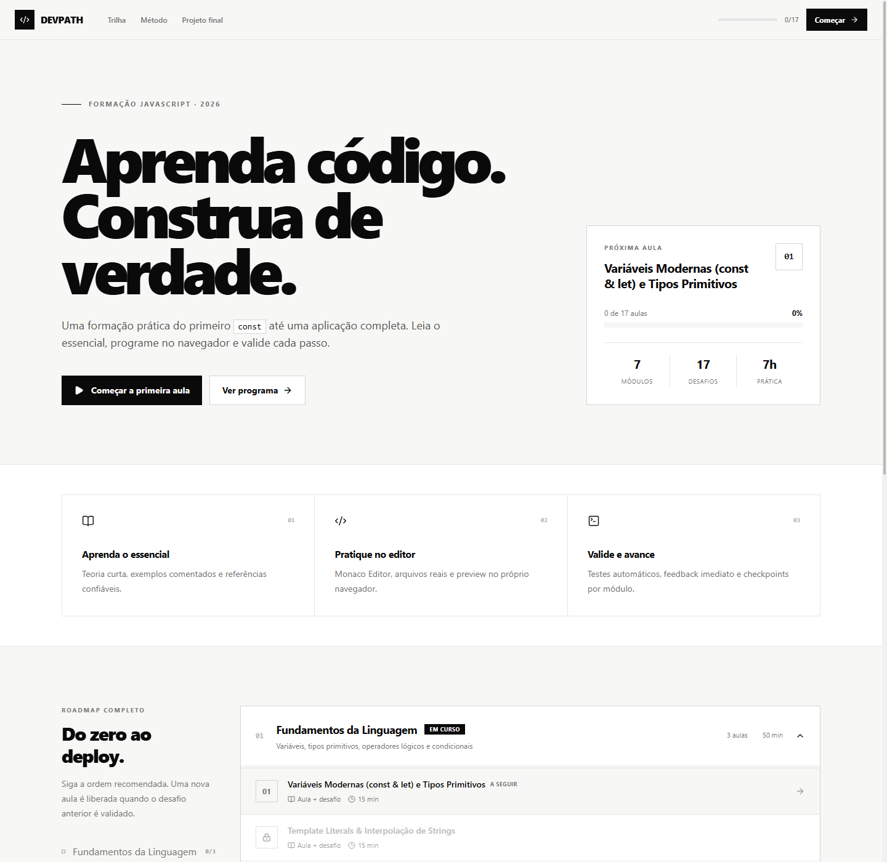
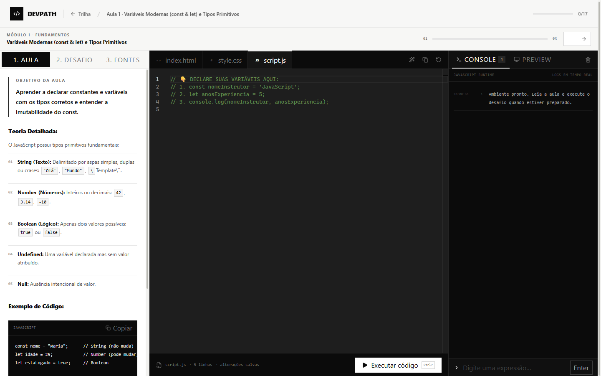
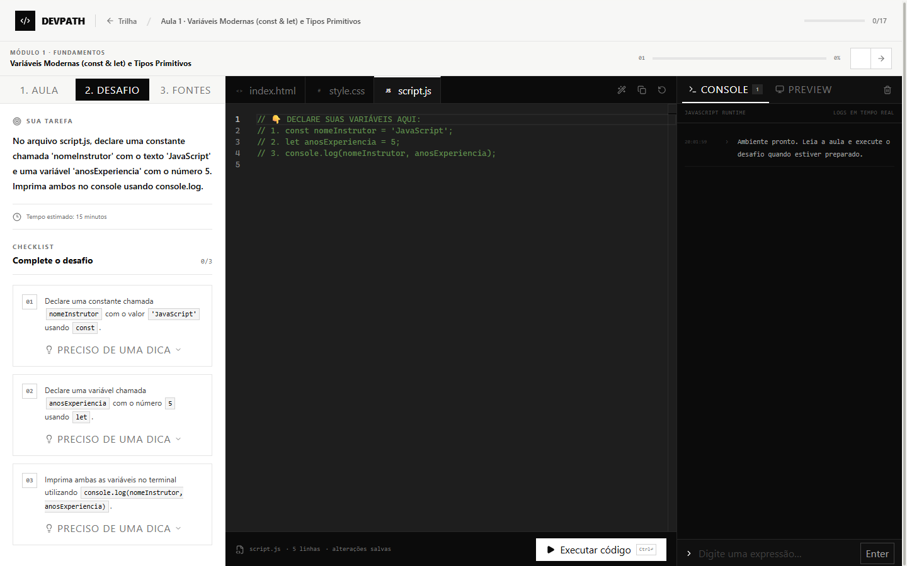



  

    

  # DevPath
  ### The Interactive Developer Roadmap & Hands-On Coding Platform

  
  
  
  
  

  

    <strong>Master modern programming through guided roadmaps, real-time feedback, and in-browser coding exercises.</strong>
  

  

    Crafted with ❤️ by <a href="https://github.com/JosFernando">José Fernando</a>
  

---

## 🌟 Overview

**DevPath** is an open-source, hands-on learning platform designed to bridge the gap between passive tutorial watching and true software engineering competence.

Instead of reading dry theory or getting overwhelmed by disconnected exercises, DevPath takes learners on an **interactive, milestone-driven journey**. Each stage pairs in-depth architectural concepts with a full-fledged in-browser code editor, interactive terminal execution, automated validation assertions, and progressive guidance.

---

## 📸 Platform Screenshots

### 1. Hands-On Interactive Playground & Monaco Code Editor
Rich in-browser coding environment powered by Monaco Editor (VS Code), featuring syntax highlighting, multi-file support (script.js, index.html, style.css), deep lessons, and live interactive console output.

  

 

### 2. Live Automated Validation & Challenge Checklist
Each milestone provides clear objectives, progressive hints, and automated assertions that test code validity on demand (Ctrl + Enter).

  

 

### 3. Visual Roadmap & Modular Curriculum
Structured milestone track taking developers step-by-step from core language fundamentals to advanced asynchronous patterns and OOP.

  

---

## ✨ Key Features

- **🗺️ Visual Learning Roadmap:** Structured progression path dividing complex subjects into bite-sized, sequential milestones.
- **💻 Monaco Editor (VS Code in the Browser):** Powered by the same engine as Visual Studio Code, offering syntax highlighting, autocompletion, intelligent diagnostics, and keyboard shortcuts (Ctrl/Cmd + Enter to run).
- **🧪 Automated In-Browser Test Runner:** Validates solutions instantly against automated unit test cases and dynamic runtime assertions.
- **🖥️ Live Interactive Console:** Custom in-browser terminal capturing console.log, output evaluation, errors, and success statuses in real time.
- **📋 Step-by-step Validation Checklist:** Clear criteria for what constitutes a passing solution, guiding developers without spoiling the challenge.
- **💡 Progressive Hint System:** Tiered hints and curated external resources (MDN, JavaScript.info) when you need an extra nudge.
- **💾 Automatic Progress Tracking:** Clean, resilient local persistence using browser storage (localStorage) with full course reset support.
- **🎨 Modern, Minimalist UI:** Built with Tailwind CSS v4, responsive layout, dark-mode editor surfaces, and smooth transitions.

---

## 📚 Curriculum Breakdown

The platform features a comprehensive, zero-to-advanced curriculum:

| Module | Title | Topics Covered |
| :--- | :--- | :--- |
| **01** | **Language Fundamentals** | Modern variables (const, let), primitives, scopes, operators & conditionals |
| **02** | **Functions & Scope** | Function declarations, arrow functions, default parameters, lexical scope |
| **03** | **Arrays & Data Structures** | Array manipulation, functional methods (map, ilter, 
educe), objects |
| **04** | **The DOM & Browser Events** | Node selection, dynamic attribute & class manipulation, event listeners |
| **05** | **Web APIs & Persistence** | Browser localStorage, JSON serialization, asynchronous timers (setInterval) |
| **06** | **Asynchronous JavaScript & REST** | Promises, sync/wait, error handling, API communication with etch() |
| **07** | **OOP & Advanced Patterns** | ES6 Classes, inheritance, private fields, closures & Capstone Project |

---

## 🛠️ Tech Stack

- **Core Framework:** [React 19](https://react.dev/)
- **Bundler & Dev Server:** [Vite 8](https://vitejs.dev/)
- **Routing:** [React Router DOM v7](https://reactrouter.com/)
- **Styling:** [Tailwind CSS v4](https://tailwindcss.com/)
- **Code Editor:** [@monaco-editor/react](https://github.com/suren-atoyan/monaco-react)
- **Icons:** [Lucide React](https://lucide.dev/)
- **Linter & Performance:** [Oxlint](https://oxc.rs/)

---

## 🚀 Getting Started

### Prerequisites

Ensure you have the following installed on your machine:
- **Node.js**: 18.0.0 or higher
- **npm** (or pnpm / yarn)

### Installation

1. **Clone the repository:**
   `ash
   git clone https://github.com/JosFernando/devpath.git
   cd devpath
   `

2. **Install dependencies:**
   `ash
   npm install
   `

3. **Start the local development server:**
   `ash
   npm run dev
   `

4. **Open in browser:**
   Navigate to [http://localhost:5173](http://localhost:5173) to start exploring the roadmap!

### Building for Production

To create an optimized production build:
`ash
npm run build
`
You can preview the production bundle locally with:
`ash
npm run preview
`

---

## 📁 Project Structure

`	ext
devpath/
├── docs/                      # Documentation assets & platform screenshots
│   └── images/                # Real captured platform UI screenshots
├── public/                    # Static assets, favicon and icons
├── src/
│   ├── assets/                # Images and SVG icons
│   ├── components/            # Reusable UI components
│   │   ├── common/            # Shared components (Navbar, Header)
│   │   ├── CodecademyEditor.jsx # Monaco-powered multi-file code editor
│   │   ├── InteractiveConsole.jsx # Live terminal & test runner display
│   │   └── ValidationChecklist.jsx # Task criteria and dynamic checklist
│   ├── context/               # Global state (ProgressContext)
│   ├── data/                  # Curricula, roadmap nodes, and coding challenges
│   │   ├── curriculum.js      # Structured lesson data
│   │   └── roadmapData.js     # Comprehensive course tracks & test suites
│   ├── pages/                 # Route pages (RoadmapPage, StagePlaygroundPage)
│   ├── App.jsx                # Application root and route configuration
│   ├── index.css              # Global styles & Tailwind imports
│   └── main.jsx               # React DOM entrypoint
├── package.json               # Dependencies and scripts
└── vite.config.js             # Vite configuration
`

---

## 🤝 Contributing

Contributions, feature requests, and curriculum additions are warmly welcomed!

1. Fork the Project
2. Create your Feature Branch (git checkout -b feature/AmazingFeature)
3. Commit your Changes (git commit -m 'feat: add some amazing feature')
4. Push to the Branch (git push origin feature/AmazingFeature)
5. Open a Pull Request

---

## 👤 Author

**José Fernando**
- GitHub: [@JosFernando](https://github.com/JosFernando)

---

## 📄 License

This project is licensed under the MIT License — see the [LICENSE](LICENSE) file for details.

  Made with ❤️ by <strong>José Fernando</strong> • Empowering developers one line of code at a time.

